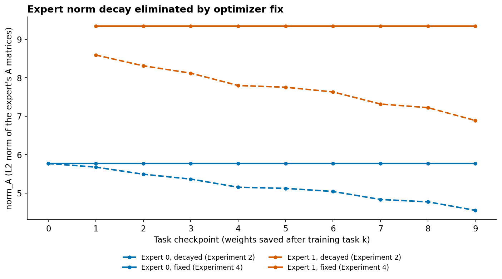
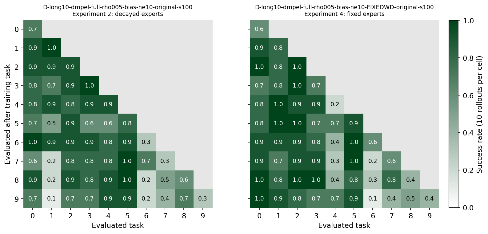
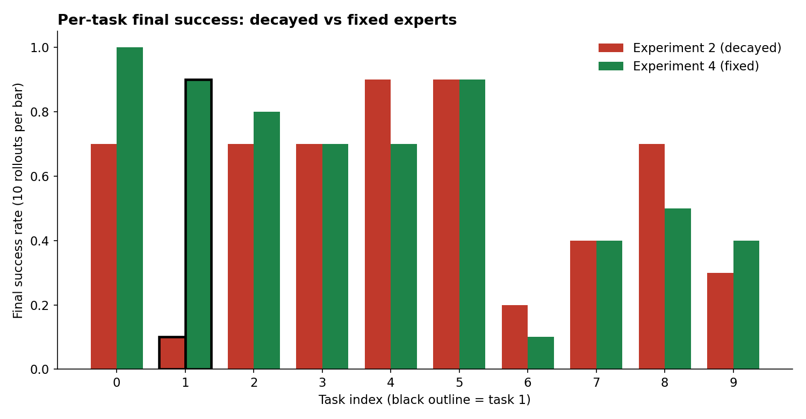

# cl-benchmark

Mechanistic analysis of expert isolation in DMPEL (arXiv 2506.05985).
AdamW weight decay silently shrinks frozen LoRA experts by ~20% over 10 tasks,
which collapsed task 1 on LIBERO-Long. Keeping the frozen experts out of the weight
decay (their rows are restored after every optimizer step) recovers that task.

## Key result

| Metric | Experiment 2 (decayed) | Experiment 4 (fixed) |
|---|---|---|
| FWT | 0.607 | 0.683 |
| NBT | 0.027 | −0.049 |
| AUC | 0.629 | 0.679 |
| Final SR | 0.560 | 0.640 |
| Task 1 final | 0.1 | 0.9 |

*One seed, 10 rollouts per cell: only the task 1 difference is statistically clear
(pooled final success 64/100 vs 56/100, p = 0.31).*

Task 1 result confirmed by two independent tests: restoring creation-time weights
post-hoc (0.2→1.0, Fisher p=0.0007) and holding frozen experts constant
during training (0.1→0.9, p=0.0011).


*Expert norms stay flat with the fix (solid) vs decaying 20% over 10 tasks (dashed).*


*Task 1's column fades 1.0→0.1 in the decayed run (left). Fixed run (right) holds 0.7–1.0.*


*Task 1: 0.1→0.9 (p=0.0011). Other tasks within noise at 10 rollouts per cell.*

## What was ruled out

- Routing forgetting: router cosine similarity stays 0.999 across all tasks (Spearman p=0.36).
- Phase-level switching: switch rate 0.83× Long/Goal; not enriched near gripper events (0.89×).

## Experiments

1. DMPEL-Goal reproduction — 3 seeds (ρ=1.0), 1 seed (ρ=0.05). FWT 0.727, NBT 0.056, AUC 0.800 (ρ=0.05 seed).
2. DMPEL-Long baseline — ρ=0.05, bias tuning. FWT 0.607, task 1 collapsed 1.0→0.1.
3. Router analysis — routing drift and mid-episode switching, Long vs Goal.
4. Restore test — expert weights swapped to creation-time weights. Task 1: 0.2→1.0, p=0.0007.
5. Optimizer fix — frozen experts held constant (rows restored after every AdamW step). Task 1: 0.1→0.9, p=0.0011.

## Reproduce

```bash
conda activate dmpel

# Baseline (Experiment 2)
python scripts/launch.py configs/runs/p1x/D-long10-dmpel-rho005-bias-ne10-original-s100.yaml --gpu 1

# Frozen-expert fix (Experiment 4)
python scripts/launch.py configs/runs/p1x/D-long10-dmpel-rho005-bias-ne10-FIXEDWD-original-s100.yaml --gpu 1

# Restore test (reads the Experiment 2 checkpoints; run from the DMPEL clone, see the script's docstring)
python scripts/restore_experts_eval.py
```

The patches in `scripts/patch_dmpel_*.py` must be applied to the DMPEL clone first, and the paths in the
specs are for the xulab machine. See `docs/DECISIONS.md` for the full protocol log.

## Layout

| Directory | Contents |
|---|---|
| `scripts/` | Run harness, patches, analysis tools |
| `cl_bench/` | Metrics and W&B logging |
| `docs/` | Protocol log, decisions, notes |
| `results/` | Per-run JSON (source of truth) |
| `analysis/` | Experiment outputs and figures |
